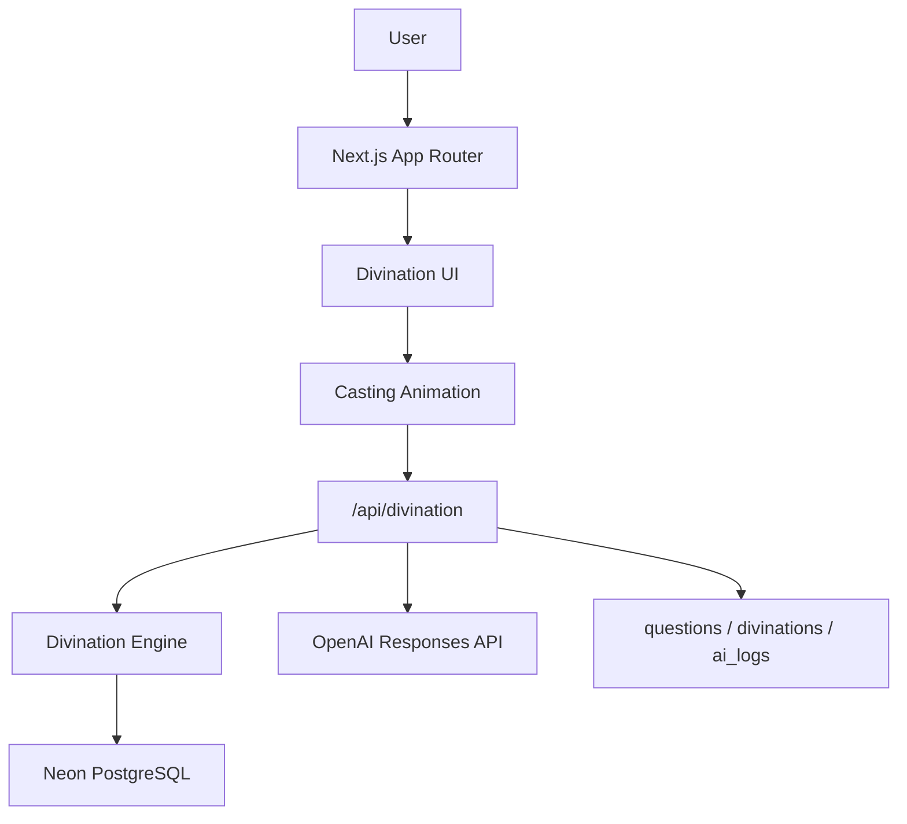

# Architecture

## System



## Directory Layout

```text
src/
  app/
    api/
      auth/[...nextauth]/route.ts
      divination/route.ts
    globals.css
    layout.tsx
    page.tsx
  components/
    divination/
      casting-experience.tsx
      hex-line.tsx
  lib/
    ai/
      openai.ts
      prompt.ts
    db/
      index.ts
      schema.ts
    divination/
      categories.ts
      engine.ts
      types.ts
```

## Hexagram Code Contract

This project follows the sample HTML exactly:

- The first generated line is the bottom line.
- Lines are generated every `800ms`.
- Six transparent placeholders are rendered before casting starts.
- On each tick, a line is appended to `currentHexagram`.
- The UI renders from index `5` down to `0`, so the newest completed lower lines appear in the correct visual position.
- The DB code is `currentHexagram.join("")`.

Do not reverse the code before saving or querying the database.

## API Contract

`POST /api/divination`

Request:

```json
{
  "question": "이번 프로젝트가 잘 될까요?",
  "lines": [1, 1, 1, 1, 0, 1]
}
```

Response:

```json
{
  "code": "111101",
  "lines": [1, 1, 1, 1, 0, 1],
  "category": "career",
  "rank": 4,
  "finalScore": 96,
  "hexagram": {
    "name": "화천대유",
    "hanja": "火天大有"
  },
  "ai": {
    "summary": "...",
    "result": "..."
  }
}
```

## Security

- `OPENAI_API_KEY` is only used in server-side code.
- The client never calls OpenAI directly.
- `DATABASE_URL` is only used by Route Handlers and server libraries.
- Vercel environment variables must be configured per environment.
